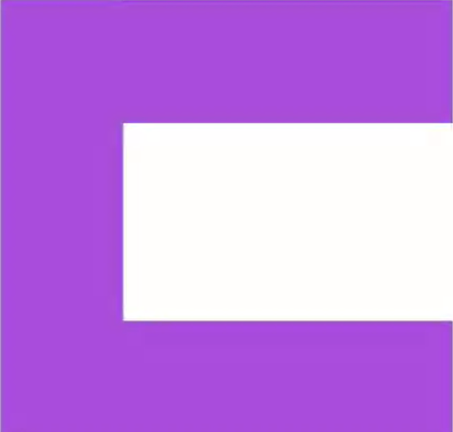
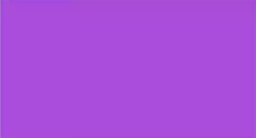
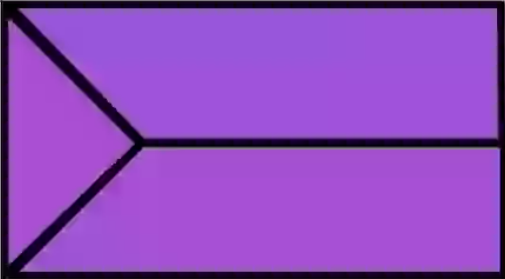
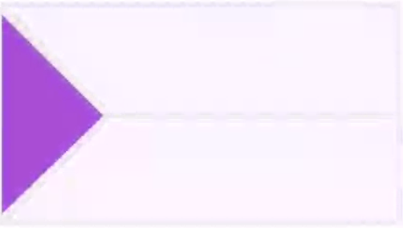

# Creating a Responsive Web Design Web


## Preparing the HTML Content and Structure - Setting up Your Project

`<meta name="viewport" content="width=device-width, initial-scale=1">`

We have a meta tag with a name of viewport. What this particular tag does by defining width as device-width
and initial-scale, this is tag that will tell individual devices not to scale the web page, but rather to use
the initial scale of 1, meaning if we're on a device that has 700 pixels across, it will render the page as
if there's only 700 pixels, allowing the rest of the HTML to move around. The device will not attempt to show
the entire web page and scale it down. And if we didn't have this particular tag in here, every device would
try to render the entire web page and we would have to zoom up. So again, the idea here is we're going
to make the page respond to the individual devices and adjust the layouts so the users don't have
to zoom in on the content.

See [Viewport meta tag](https://developer.mozilla.org/en-US/docs/Mozilla/Mobile/Viewport_meta_tag)


## Creating the Style and Layout with CSS: Defining the Basic Text Styles

```
h1 { margin: 0 0 1em 0; ... }
H2 { margin: 0 0 .5em 0;... }
```

Inside of here we're going to set a margin. Now for the properties I'm going to use shorthand style, which goes in the order of a clock. So the first one is top, right is second, bottom is third, and left is fourth.

Then for the amount of space after an h1 tag, we're going to use 1em. Now by specifying 1em, we're basically saying 1 times the base font, so this will be approximately 16px. Now I say approximately because by defining em's, we're giving the devices a little bit of leeway so that they can render the type based on their individual screen sizes. So fonts will look better across multiple devices if you use em's versus picking specific point or pixel sizes.

## Creating the Style and Layout with CSS: Style the Heading and Page Container

```
header { height: 430px; background: #cf0004 url(../images/banner_1200.jpg) no-repeat center bottom; position: relative; }
```
Then the last property we're going to set is going to be position. We'll set a position value of relative. What this position property will do is make sure that any items that are positioned inside of the header element will be positioned in relation to the header element itself. 

```
#page { max-width: 1200px; margin: 0 auto; position: relative; }
```

`position: relative`: This means any items positioned inside of the page element will be positioned in relation to this. Now this will become important later one because we're going to reposition the navigation element, and the navigation is not inside of the header, which also has a position relative, so the navigation will position in relation to the page

Take a look at this example [CSS Positioning - Relative Positioning](https://codepen.io/jalanya/pen/pLEzJJ)


## Creating the Style and Layout with CSS: Style the Logo and Hero Item

```
header a.logo {
  position: absolute;
  display: block;
  width: 160px;
  height: 66px;
  background: url(../images/logo.svg) no-repeat 0 0;
  background-size: contain;
  top: 15px;
  left: 20px;
}
```

We're going to set a property called `background-size`. We're going to set this to `contain`. This means the background graphic is going to be sized to fit within the height and width, and since we set the height and width to a proportion based on the size of the logo.svg, which is 160 x 66, this will proportionally scale and fill the entire element with the logo. 

[background-size](https://developer.mozilla.org/en-US/docs/Web/CSS/background-size)

## Creating the Style and Layout with CSS: Creating the Button Style

[transition](https://developer.mozilla.org/en-US/docs/Web/CSS/transition) |
[Using CSS transation](https://developer.mozilla.org/en-US/docs/Web/CSS/CSS_Transitions/Using_CSS_transitions)


### **Functional notation**: **rgb(R, G, B[, A])** or **rgba(R, G, B, A)**
R (red), G (green), and B (blue) can be either `<integer>`s or `<percentage>`s, where the number 255 corresponds to 100%. A (alpha) can be a `<number>` between 0 and 1, or a `<percentage>`, where the number 1 corresponds to 100% (full opacity).

```
/* Functional syntax */
rgba(51, 170, 51, .1)    /*  10% opaque green */ 
rgba(51, 170, 51, .4)    /*  40% opaque green */ 
rgba(51, 170, 51, .7)    /*  70% opaque green */ 
rgba(51, 170, 51,  1)    /* full opaque green */ 
```


## Creating the Style and Layout with CSS: Clearing Floats with CSS Pseudo-elements

The section of main is not going down to extend around all of the items that are floating inside of it, because whenever we float or position an element, the parent container will not extend to the height or width of the items inside.

So what we need to do is have another HTML element in the page with a clear property so that the parent item will clear all of the floating items, but I don't want to add any HTML to our page; I only want the HTML to be as minimal as possible and only relate to the content. So we can use something called a pseudo-element inside of CSS to add a phantom HTML element to our sections

```section::after { content: ''; display: block; clear: both; }```

[Pseudo-elements](https://developer.mozilla.org/en-US/docs/Web/CSS/Pseudo-elements) | [::after (:after)](https://developer.mozilla.org/en-US/docs/Web/CSS/::after) 


## Creating the Style and Layout with CSS: Adding Content with Pseudo-elements

[Unicode symbols](https://en.wikipedia.org/wiki/Unicode_symbols)


## Creating a Menu System with CSS: Re-positioning the Nav

[What No One Told You About Z-Index](https://philipwalton.com/articles/what-no-one-told-you-about-z-index) | 
[The Z-Index CSS Property: A Comprehensive Look](https://www.smashingmagazine.com/2009/09/the-z-index-css-property-a-comprehensive-look/) |
[CSS/Properties/z-index](https://www.w3.org/wiki/CSS/Properties/z-index) | 
[z-index example](https://codepen.io/jalanya/pen/OvgGoP)


## Creating a Menu System with CSS: Styling the Nav List-items and Links

Child selector `A > B`. Any element matching `B` that is a *direct child* of an element matching `A`.

[Child combinator](https://developer.mozilla.org/en-US/docs/Web/CSS/Child_selectors) | [Combinators and groups of selectors](https://developer.mozilla.org/en-US/docs/Learn/CSS/Introduction_to_CSS/Combinators_and_multiple_selectors) 
| [Specificity](https://developer.mozilla.org/en-US/docs/Web/CSS/Specificity) | [Specificity Calculator](https://specificity.keegan.st/)


## Creating a Menu System with CSS: Device Compatibility Options for Nav

If you want to support submenus on the Android platform and allow people to select those with touch, make sure that the top-level item is linked to a pound sign `#` or hash symbol, which is a self-link. That way the Android browser won't navigate away, and then somebody can make a secondary choice.

Now on the iOS platform, touchstart also activates a hover, just like on Android; however, if you tap the link a second time, the browser will then navigate away. This means on the iOS platform, you can have your top level navigation items linked to a page in addition to having them trigger the submenu.

Now the biggest compatibility issue you're going to find is with touch-enabled PCs. These particular devices do not activate CSS hover classes based on touch. So when you first tap on the navigation items, nothing's going to happen. If they're hyperlinked, you'll go to the hyperlink, but there's no way to activate the submenu simply using the pseudo-class of hover in CSS. Now the browsers on these devices do support something called ARIA, which stands for Accessible Rich Internet Applications. And actually ARIA attributes are really quick and easy to add into our menu system, and since they use standard HTML attributes, this won't have any negative effect on other browsers and devices.

So what we can simply do is to add the aria-haspopup attribute and set that equal to true: `aria-haspopup="true"`. And what we need to do is apply that to any anchor tag inside of a list item that triggers a submenu. 

[aria-haspopup](https://www.w3.org/TR/wai-aria/#aria-haspopup) | [WAI-ARIA](https://www.w3.org/TR/wai-aria/)


## Creating a Menu System with CSS: Adding Indication Arrows

Now to create the triangle, we're going to use a series of border properties. So to visually demonstrate this, if we had a really thick border on an element in CSS on the top, left, and bottom sides of a block, it would look something like this.



If we were to set the **height and width to 0**, we would still have all of the sides of the borders being drawn.



Now when borders intersect on the corners, they actually intersect at a 45-degree angle.



So what we can do is define a left border for an arrow that points to the right, and then we can set transparency settings for the top and bottom borders.

This will result in the browser only showing what is available on the left-hand border, and so this would result in the browser of us seeing only a portion of the left-hand border.



[CSS Triangles example](https://codepen.io/jalanya/pen/YaeyNb) | [Attribute selectors](https://developer.mozilla.org/en-US/docs/Web/CSS/Attribute_selectors) | [top](https://developer.mozilla.org/en-US/docs/Web/CSS/top) | [right](https://developer.mozilla.org/en-US/docs/Web/CSS/right)


## Making Layout Adjustments for Large and Medium Screens: Making Minor Adjustments for Larger Screens

```
@media screen and (max-width: 1000px) {
 ...
}
```

Any rules that we put inside of here will take effect until the screen size is at a maximum of 1,000px. Once we're above 1,000px, these rules will no longer apply. But anything under 1,000px, these rules will also take effect, which means any rules that you redefine from up above will take precedence because they're being defined later in your CSS file.

[Using media queries](https://developer.mozilla.org/en-US/docs/Web/CSS/Media_Queries/Using_media_queries) | [Targeting media features](https://developer.mozilla.org/en-US/docs/Web/CSS/Media_Queries/Using_media_queries#Targeting_media_features)

## Making Adjustments for Small Screens: Moving the Navigation for Smaller Screens

[background-position](https://developer.mozilla.org/en-US/docs/Web/CSS/background-position)